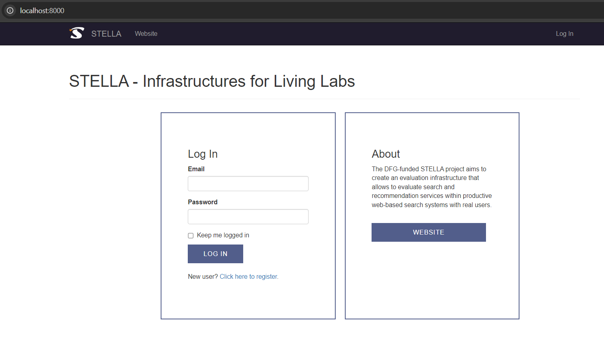
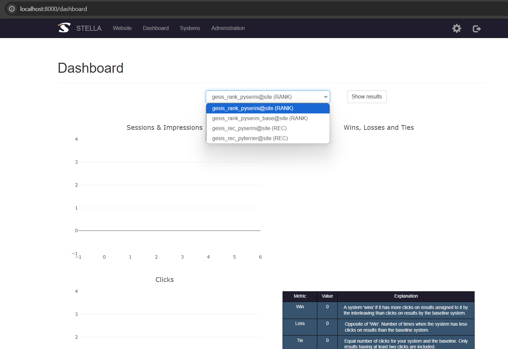
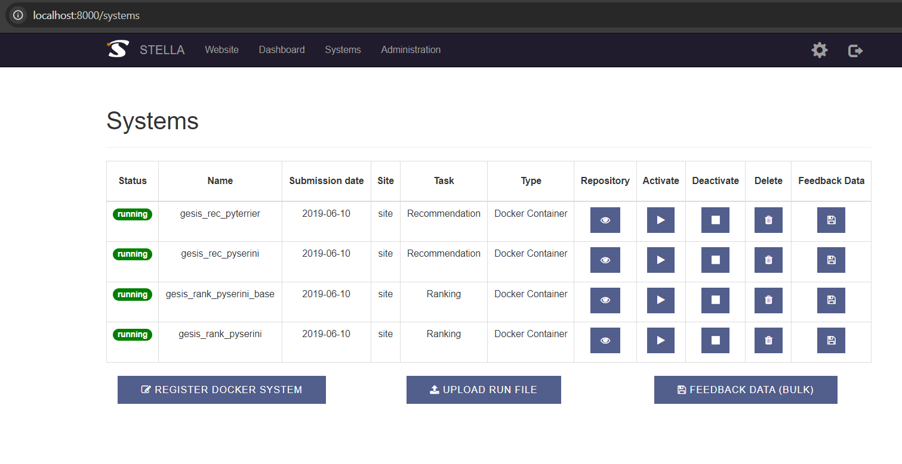
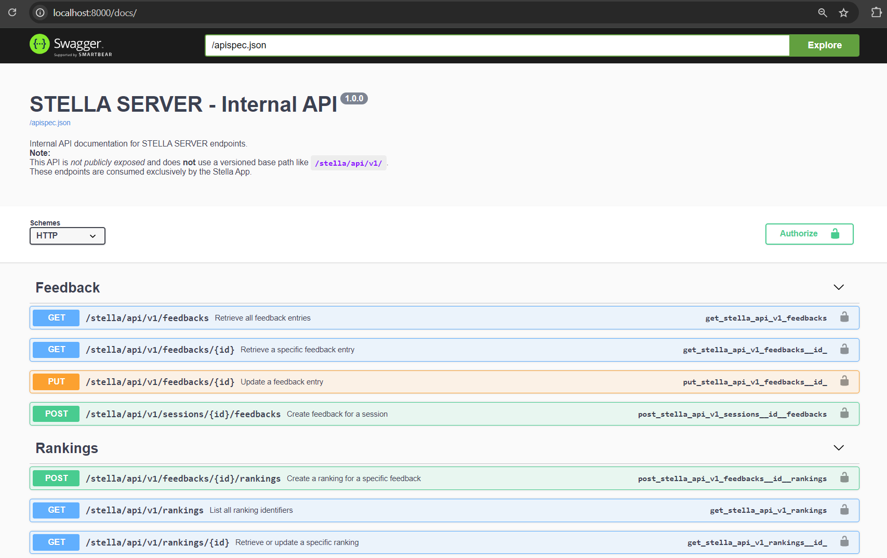
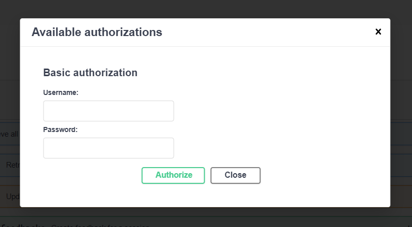

This section describes how to access and interact with the STELLA Server API once the application is running.

The STELLA Server API is **not intended to be exposed publicly**. In a standard deployment, it is consumed **only by the STELLA App** over the internal Docker network. External clients should not interact with the server API directly.

---

## Application Access

For local testing and validation of a STELLA setup, the STELLA Server API can be accessed via the following endpoints:

- **STELLA  Server base URL:**  
  `http://localhost:8000`

- **Swagger / OpenAPI documentation:**  
  `http://localhost:8000/docs`

These endpoints are available only in development setups where ports are explicitly exposed.

## Server UI

The STELLA Server UI is accessible at `http://localhost:8000`

You can log in using any of the admin, user or site credentials.

After logging in, the main dashboard is available at `http://localhost:8000/dashboard`

All registered experimental and baseline systems can be viewed at `http://localhost:8000/systems`

## Swagger UI

The Swagger UI provides an interactive interface that allows users and developers to:

- inspect request and response schemas
- test API endpoints locally
- validate communication between the STELLA App and the STELLA Server
- debug experiment execution, session handling and feedback ingestion

The Swagger interface displays the current API version provided by the running STELLA Server instance and provides an interactive view of all available endpoints and would be available at `http://localhost:8000/docs`

Because the STELLA Server API is internal-only, testing or using POST endpoints requires authorization. Click the Authorize button in the top-right corner of the Swagger UI to provide credentials.

You can use any of the admin, user, or site credentials to authorize and execute the endpoints.

## Endpoint Semantics

A conceptual and workflow-oriented explanation of the STELLA Server API endpoints is provided in the following documentation:

[**Site Owner → REST API Documentation**](../site-owner/server-rest.md)  

This documentation describes how individual endpoints relate to experiment execution, session lifecycle management and feedback collection.
